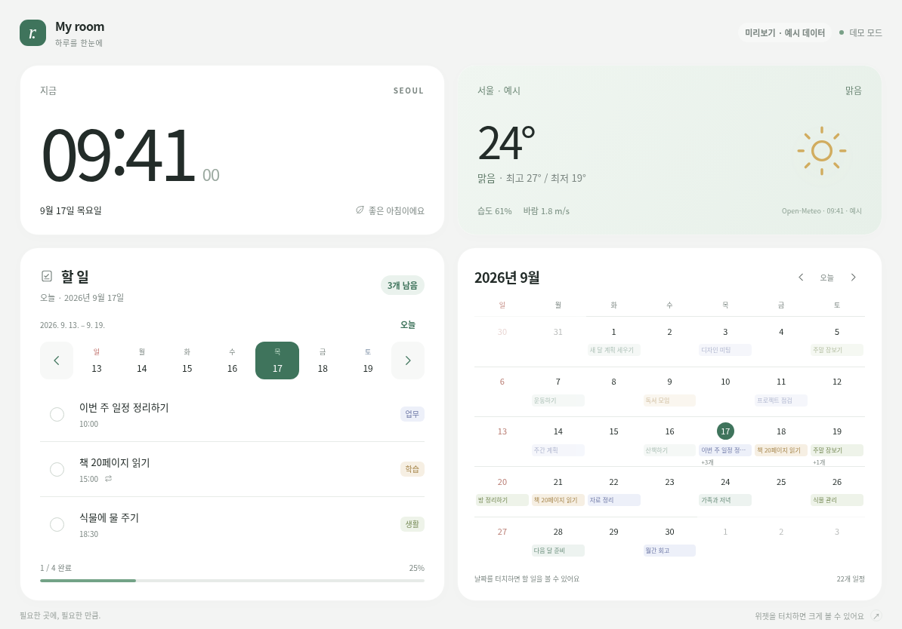
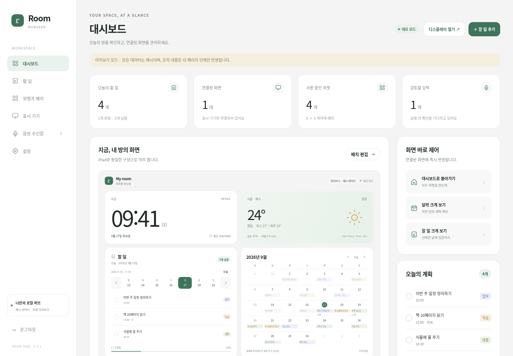
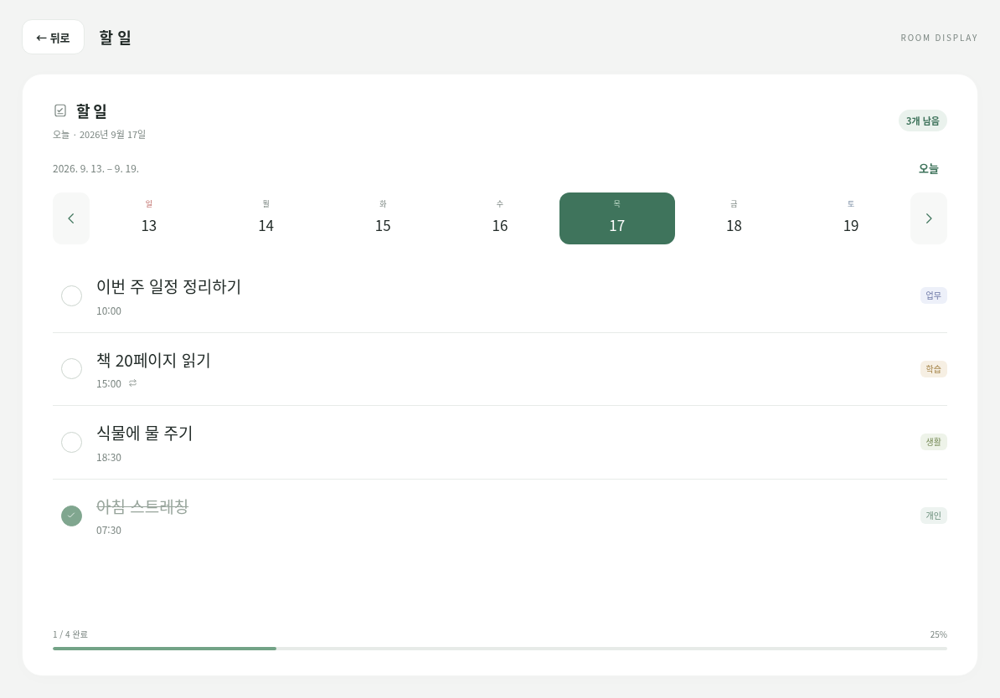

# Room Hub

**남는 iPad를 방의 시계·날씨·할 일·달력 허브로.**  
로컬 서버에서 데이터를 관리하고, 같은 네트워크의 iPad에서 확인하고 완료 체크하는 터치 대시보드입니다.

**버전 0.1.1 · Python 3.11 이상 · FastAPI + SQLite · 빌드 과정 없는 웹 UI**



> 이 저장소는 실행 가능한 서버·클라이언트·관리자·기본 위젯을 모두 포함합니다. 이전 패치를 순서대로 적용할 필요가 없습니다. 화면의 일정과 날씨는 데모 데이터이며 실제 서버는 빈 할 일 목록과 위치 미설정 상태로 시작합니다.

[설치·업데이트](docs/SETUP.md) · [GitHub 업로드](docs/GITHUB_PUBLISH.md) · [위젯 개발](docs/WIDGET_API.md) · [API](docs/API.md) · [검증 기록](docs/TEST_REPORT.md)

## 주요 기능

| 영역 | 현재 구현 |
|---|---|
| iPad 화면 | 상단 시계·날씨, 하단 왼쪽 할 일·오른쪽 월간 달력, 터치 확대·뒤로가기 |
| 날짜 탐색 | 할 일의 날짜 줄은 **일요일~토요일 고정**, 이전·다음 주, 오늘 복귀, 달력과 날짜 연동 |
| 완료 체크 | iPad에서 해당 날짜 회차의 **완료·완료 취소**. 나머지 편집은 관리자 전용 |
| 반복 할 일 | 매일·평일·선택 요일·매월·간격·종료일 포함 생성, 회차별 완료, 삭제 범위 선택 |
| 관리자 | 할 일 생성·편집, 위젯 배치·설정, 연결 화면 관리, 원격 확대·날짜 이동 |
| 위젯 | 시계·날씨·할 일·달력·메모. 폴더형 확장, 격자 배치, 작은 크기 요약 표시 |
| 기기 연결 | 10분·1회용 연결 링크/QR, 표시용 세션, 연결 해제 |
| 음성 입력 준비 | JSON 전사 텍스트·UTF-8 TXT·음성 파일 수신함과 검토 UI |
| 저장 | 로컬 SQLite, JSON 내보내기, DB 백업·복원 도구 |

**관리자 미리보기가 계속 줄어드는 오류의 수정도 포함되어 있습니다.**

<details>
<summary>관리자 화면과 할 일 확대 화면</summary>





</details>

## 구성

```text
Windows / Linux / 지원되는 NAS 컨테이너
└─ Room Hub 서버 (FastAPI + SQLite, 1 worker)
   ├─ /manager     관리자: 편집·배치·연결·원격 제어
   ├─ /client      iPad: 조회·날짜 이동·확대·완료 체크
   ├─ /api/...     데이터·음성 수신·위젯 데이터
   └─ /ws/...      변경 알림 → 클라이언트가 최신 상태 조회
```

앱 서명이나 App Store 설치는 필요 없습니다. 프런트엔드에 npm 빌드나 외부 CDN도 필요 없습니다. 화면은 시스템 폰트를 사용합니다.

**서버는 계속 실행되어 있어야 최신 데이터와 완료 체크가 작동합니다.** 서버가 끊겨도 이미 열린 페이지는 마지막 데이터를 표시할 수 있지만, 오프라인 새로고침·재시작을 보장하지 않습니다. 저장소를 GitHub에 올리는 일은 서버를 호스팅하는 일과 다릅니다. [배포·운영 경계](docs/DEPLOYMENT.md)

## 빠른 시작 — Windows

Python 3.11 이상을 설치한 뒤, 이 README가 있는 폴더에서 `START_WINDOWS.bat`를 실행합니다. Python Launcher의 `py` 명령이 없는 환경은 다음과 같이 실행합니다.

```powershell
python -m venv .venv
.\.venv\Scripts\python.exe -m pip install -r requirements.txt
.\.venv\Scripts\python.exe run.py
```

서버 콘솔의 관리자 키를 사용해 PC에서 다음 주소에 로그인합니다.

```text
http://localhost:8088/manager
```

**키가 출력된 콘솔 스크린샷을 공개하지 마세요.** 별도 키를 지정하지 않으면 첫 실행에 생성되어 `data/admin-token.txt`와 `data/ingest-token.txt`에 저장됩니다. 실제 키나 데이터는 이 저장소에 포함하지 않습니다.

## iPad 연결

1. 서버와 iPad를 같은 로컬 네트워크에 연결합니다. 서버가 유선, iPad가 Wi-Fi여도 서로 통신 가능한 LAN이면 됩니다.
2. 관리자 **표시 기기 → 새 화면 연결**에서 서버의 LAN 주소를 입력하고 연결 링크 또는 QR을 만듭니다.
3. iPad Safari에서 링크를 열고 연결합니다. iPad에서 `localhost`는 서버 PC가 아닙니다.
4. 관리자 **설정**에서 날씨 위치·시간대를 정하고, 할 일·위젯을 설정합니다.

```text
예시: http://192.168.0.20:8088/client
실제 서버 IP로 바꾸세요. 공유기 포트포워딩은 필요하지 않습니다.
```

연결 이후 같은 `/client`를 사용합니다. 표시 세션은 30일이며 만료·연결 해제·쿠키 삭제 시 다시 연결합니다. 키보드·작업 편집창은 iPad에 제공하지 않습니다.

## 다른 실행 방법

### Linux / macOS

```bash
sh start.sh
```

Python 3.11 이상과 venv가 필요합니다. 구체적인 설정은 [설치 안내](docs/SETUP.md)를 확인하세요.

### Docker Compose

Docker와 Compose가 설치된 환경에서:

```bash
docker compose up -d --build
docker compose logs room-hub
```

`room-hub-data` named volume에 데이터를 저장합니다. `restart: unless-stopped` 설정이 포함되어 있습니다. **`docker compose down -v`는 데이터 볼륨을 삭제할 수 있으므로 사용하지 마세요.** TrueNAS의 버전·앱 런타임·경로·권한은 별도 확인이 필요합니다. [Docker·TrueNAS·상시 실행](docs/DEPLOYMENT.md)

## 서버 없이 화면만 보기

`START_HERE.html` 또는 아래 파일을 PC 브라우저에서 엽니다.

- `previews/client_preview.html`
- `previews/manager_preview.html`

이 파일들은 네트워크 없는 예시 데이터 데모입니다. 두 페이지를 따로 열어도 서로 연결되지 않고 새로 열면 변경이 사라집니다. 관리자 내부 미리보기는 관리자 데모 상태를 반영합니다. 실제 iPad 사용은 서버 주소로 접속하세요.

## 폴더 구조

```text
room-hub/
├── README.md                  프로젝트·실행 안내
├── CHANGELOG.md               통합 변경 이력
├── SECURITY.md                권한·비밀정보·배포 경계
├── CONTRIBUTING.md            개발·검증 규칙
├── .github/                   자동 검사·수동 ZIP 빌드·이슈/PR 양식
├── app/                       API, 저장, 권한, 반복, 날씨
├── web/                       클라이언트·관리자·공통 UI
├── widgets/                   clock, weather, todos, calendar, note
├── docs/                      설치·배포·API·확장·검증·개발 후보
├── examples/                  음성 어댑터 계약과 전송 예제
├── scripts/                   미리보기 생성·검증·백업 복원·ZIP 생성
├── tests/                     서버·완료 권한·저장소 패키징 테스트
├── previews/                  독립 HTML 데모·가상 데이터
├── deploy/                    TrueNAS 예시
├── Dockerfile / compose.yaml  컨테이너 실행
└── run.py                     서버 시작
```

`data/`, `.env`, `.venv`, `artifacts/`, `dist/`는 실행하거나 개발할 때 생기는 로컬 파일이며 Git 추적 대상이 아닙니다.

## 검증

```bash
python -m pip install -r requirements-dev.txt
python scripts/check_repo.py
python -m pytest -q
python scripts/live_smoke.py
python scripts/build_previews.py
python -m playwright install chromium
python scripts/browser_smoke.py
python scripts/todo_regression.py
python scripts/todo_transport_regression.py
python scripts/preview_regression.py --seconds 65
```

Linux의 브라우저 시스템 라이브러리는 필요할 때 `python -m playwright install --with-deps chromium`으로 설치합니다. 원본 결과·스크린샷은 무시되는 `artifacts/`에 기록됩니다. 테스트는 운영 데이터와 분리하여 실행하세요. [검증 상세](docs/TESTING.md)

GitHub Actions 정의는 포함하지만, 이 ZIP을 준비하면서 원격 GitHub Actions나 실제 Docker/TrueNAS에서 실행했다는 뜻은 아닙니다. 제공 시점의 실제 재검증 범위는 [검증 기록](docs/TEST_REPORT.md)에 있습니다.

## 현재 범위와 개발 후보

실제 Alexa/Google Home 연결, STT, 자연어 자동 실행, iCloud 동기화, 완전 오프라인 PWA, 무기한 기기 세션, 기기별 영구 레이아웃은 **구현되지 않았습니다**.

타이머·다음 일정/D-day·서버 상태·실내 환경·스마트팜·방 모드·음악 제어는 [로드맵](docs/ROADMAP.md)의 **미구현 후보**입니다. 이 통합본에 새 위젯 기능을 임의로 추가하지 않았습니다.

## GitHub에 올리기

압축을 푼 **`room-hub` 안의 내용**을 저장소 루트로 사용합니다. ZIP 파일만 저장소에 올리는 방식이 아닙니다. 실제 DB·키·음원·연결 링크는 올리지 마세요. [Windows 기준 업로드 안내](docs/GITHUB_PUBLISH.md)

## 라이선스 상태

프로젝트 소유자가 라이선스를 아직 선택하지 않았으므로 이 패키지에는 임의의 오픈소스 라이선스를 부여하지 않았습니다. 공개 배포 전 저장소 소유자가 사용할 라이선스와 기여 정책을 결정하세요. 이 문구가 라이선스 허용문을 대신하지는 않습니다. 의존성·외부 서비스 정보는 [THIRD_PARTY_NOTICES.md](THIRD_PARTY_NOTICES.md)를 참고하세요.
