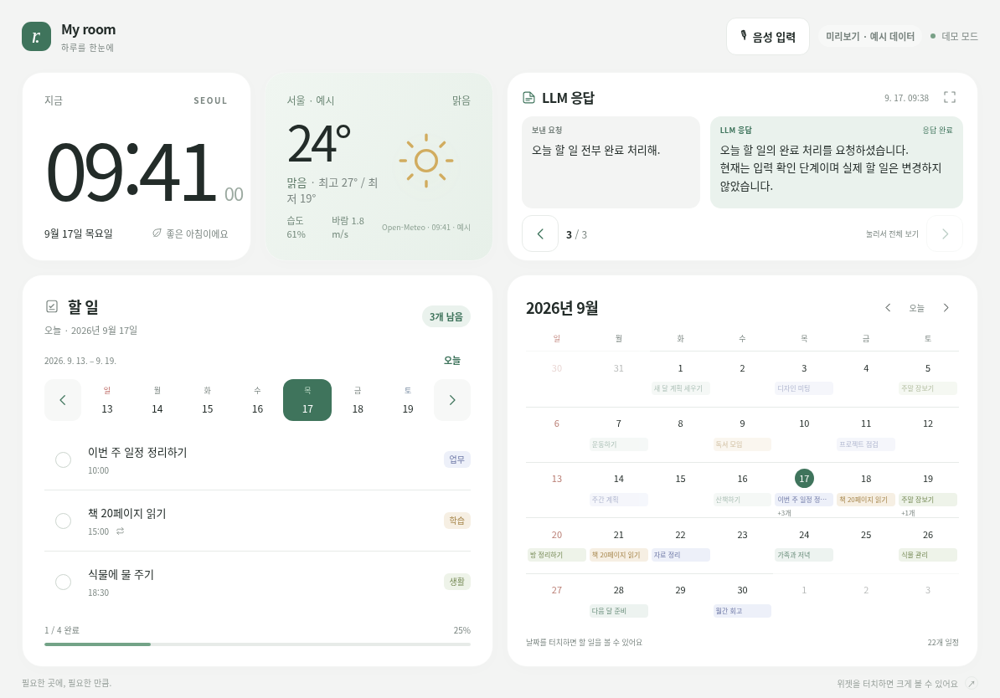
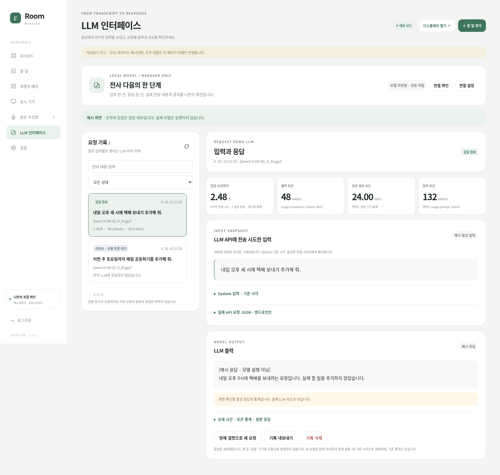

# Room Hub 0.1.7

**LG V35 로컬 서버 + iPad 생활 대시보드 + 음성 전사 + 확인 기반 로컬 비서.**

Room Hub는 방에 남는 iPad를 시계·날씨·할 일·달력 허브로 사용하고, 같은 LAN의 로컬 서버가 데이터 저장·실시간 동기화·음성 전사를 담당하도록 만든 개인용 프로젝트입니다. 현재 소스는 **0.1.7**이며, 이전 버전의 패치를 순서대로 적용할 필요가 없는 통합본입니다.

> 이 저장소에는 운영 DB, 인증 토큰, TLS 개인키, 녹음 파일, Whisper 모델, LLM 모델이 포함되지 않습니다. GitHub에는 소스만 올리세요.

[현재 상태](docs/CURRENT_STATUS.md) · [설치](docs/SETUP.md) · [V35/Termux](docs/V35_TERMUX.md) · [V35 Git 업데이트](docs/V35_GIT_UPDATE.md) · [배포/백업](docs/DEPLOYMENT.md) · [GitHub 업로드](docs/GITHUB_PUBLISH.md)



## 0.1.7 메모·알람

관리자 메모 저장·편집·검색·고정과 선택적 iPad 공유, 1회/요일 반복 알람, 확인·종료·5분 미루기를 추가했습니다. 기존 고정 메모와 배치는 보존합니다.

**소리는 활성 iPad 페이지에서 사용자 허용 후에만 사용합니다. 잠금 화면 푸시/네이티브 알람과 음성 메모·알람 도구는 포함하지 않습니다.**

[기능과 한계](docs/NOTES_ALARMS.md) · [V35 적용·롤백](docs/UPDATE_017.md) · [0.1.7 검증](docs/TEST_REPORT_017.md)

## 기존 기반 기능

| 영역 | 구현 상태 |
|---|---|
| iPad 대시보드 | 시계, 날씨, 날짜별 할 일, 전체 할 일, 달력, 메모, LLM 응답 위젯 |
| 날짜별 할 일 | 일요일~토요일 고정 주간 탐색, 이전/다음 주, 오늘 복귀 |
| 전체 할 일 | 등록된 모든 회차를 날짜·시간 순으로 탐색 |
| 완료 처리 | iPad에서 완료/완료 취소 가능. 생성·수정·삭제는 관리자 전용 |
| 반복 일정 | 매일, 평일, 요일 선택, 월간, N 간격, 종료일 포함 |
| 위젯 시스템 | 폴더형 플러그인, 4~16 격자, 위젯별 크기/위치 설정 |
| 음성 | iPad 버튼 녹음 → HTTPS 업로드 → V35 whisper.cpp 로컬 전사 → 관리자 수신함 |
| LLM/비서 관리자 | 자동 분기·실제 조회·변경 미리보기/확인·일반 대화·입력/결과/통계 기록 |
| LLM 클라이언트 위젯 | 처리된 원문/LLM 응답/서버 실행 결과를 4×2에서 한 쌍씩 탐색. 새 확인 권한 없음 |
| LLM 모델 | 기존 Qwen3-0.6B Q5_K_M / CPU 6T 연결 재사용. 새 설치 기본값은 비활성 |
| 저장 | SQLite, JSON 내보내기, DB 복원 도구 |
| 연결 | 표시 기기 1회용 QR/링크, WebSocket 갱신, 관리자 원격 화면 제어 |

### 현재 운영 기준

2026-09-20 사용자는 **V35 Termux/PRoot roomhub에 Room Hub 0.1.7 업데이트 패키지를 적용**했다고 확인했습니다. iPad HTTPS8443, Whisper multilingual Base / 한국어 / **6 threads / careful(beam 5)**, Qwen3-0.6B-Q5_K_M CPU6T/컨텍스트1024/non-thinking 구조는 유지합니다.

현재 V35의 `~/room-hub`는 아직 패키지 설치 디렉터리라 Git commit/tree 동일성은 검증되지 않았습니다. [V35 Git 관리형 업데이트](docs/V35_GIT_UPDATE.md)로 전환한 뒤 `update-from-git.sh --check`를 소스 동일성 기준으로 사용합니다. 0.1.7 설치 완료와 실제 iPad 알람 소리·절전·장시간 운용 검증은 구분합니다.

### 0.1.6에서 달라진 것

서버 공통 시계/날짜, 구두점·구어체 조회, 원문 날짜와 의미가 같은 ISO 제안 허용, 완료 상태/범위 검증, UI와 비서의 공통 SQLite 읽기 서비스, 기능 등록부와 조회 근거 표시, 일반 대화 반복/에코/길이 가드입니다. 명확한 조회는 모델을 호출하지 않습니다. ‘브리핑’도 사실 목록을 우선 표시합니다. 기록에 DB 조회 시각·출처·전체 개수·잘림을 남깁니다.

**등록·완료·완료취소·삭제는 관리자 확인 후 실행**합니다. 기존 iPad 완료 토글만 그대로 허용합니다. 새 메모 CRUD·알람 스케줄러·MCP·다중 턴 지시·자동 음성 실행은 포함하지 않습니다. 일반 대화와 기존 직접전송 모드는 DB를 조회/변경하지 않습니다.

[기능 상세](docs/CONTEXT_016.md) · [V35 업데이트](docs/CONTEXT_UPDATE_016.md) · [검증과 한계](docs/CONTEXT_TEST_REPORT_016.md)

## 구조

```text
[iPad Safari]
  ├─ dashboard / widgets
  └─ microphone recording
          │ HTTPS :8443 (V35 deployment)
          ▼
[Room Hub :8088]
  ├─ FastAPI + WebSocket
  ├─ SQLite
  ├─ weather / todos / widgets
  ├─ speech queue → whisper.cpp
  └─ LLM request notebook → local LLM API + confirmed assistant tools
```

Windows PC는 서버를 실행할 필요 없이 필요할 때 `/manager`에 접속하는 관리자 단말로 사용할 수 있습니다. 현재 V35 배포는 `termux-services`로 Room Hub를 백그라운드 실행하고, 재부팅 후 서비스 관리자를 시작하는 동작은 Tasker 같은 외부 자동화에서 호출할 수 있습니다. 자세한 내용은 [V35/Termux 안내](docs/V35_TERMUX.md)를 확인하세요.\n\n운영 V35를 Git clone으로 전환한 뒤에는 **기능 개발 → PR → 사용자 검토/Merge → 최종 main CI 확인 → V35 fast-forward 업데이트** 흐름을 권장합니다. 운영 DB·키·모델은 Git에 넣지 않습니다. [V35 Git 관리형 업데이트](docs/V35_GIT_UPDATE.md)

## 빠른 시작 — 일반 Python

Python 3.11 이상:

```powershell
python -m venv .venv
.\.venv\Scripts\python.exe -m pip install -r requirements.txt
.\.venv\Scripts\python.exe run.py
```

Linux/macOS:

```bash
python3 -m venv .venv
.venv/bin/python -m pip install -r requirements.txt
.venv/bin/python run.py
```

관리자:

```text
http://localhost:8088/manager
```

LAN의 iPad에서는 `localhost`가 아니라 서버의 실제 LAN 주소를 사용합니다. 일반 HTTP 클라이언트는 표시/할 일 조작에 사용할 수 있지만, **iPad 마이크는 신뢰된 HTTPS가 필요**합니다. V35용 음성·HTTPS 설치는 [V35/Termux](docs/V35_TERMUX.md)와 [Speech API](docs/SPEECH_API.md)를 참고하세요.

## 위젯

기본 위젯은 `widgets/<widget-id>/` 폴더 하나로 구성됩니다.

```text
widgets/
├── clock/
├── weather/
├── todos/
├── all-todos/
├── calendar/
├── note/
└── llm-response/
```

새 위젯은 `manifest.json`, `widget.js`, `style.css`로 추가할 수 있습니다. [위젯 API](docs/WIDGET_API.md)

### LLM 응답 위젯

기본 크기 **4×2**. 실제로 LLM 전송을 시도한 기록의 사용자 입력과 최종 응답을 한 화면에 한 쌍씩 표시하고 좌우 화살표로 이전/다음 기록을 탐색합니다. System 프롬프트, 인증 키, 내부 요청 상세는 표시 기기에 전달하지 않습니다.



## 서버 없이 화면 확인

실제 서버/DB를 만들지 않고 UI만 확인하려면:

- `START_HERE.html`
- `previews/client_preview.html`
- `previews/manager_preview.html`
- `previews/llm_widget_preview.html`

미리보기는 합성 데이터이고 실제 운영 데이터와 동기화되지 않습니다.

## Widget Assistant 연결

[LLM Widget Bridge](docs/LLM_WIDGET_BRIDGE.md)는 명확한 메모·할 일·일정을 기존 Adapter로 바로 조회하고,
미확정 Widget 요청만 domain-scoped JSON Proposal로 분석합니다. 자동 모드의 일반 자유 응답은
명확화 안내로 대체하며, 명시적 일반 대화 모드는 Widget 요청이 아닐 때만 유지합니다.
새 Adapter 쓰기는 기존 관리자 확인을 거칩니다. [라우팅 안정화](docs/ROUTING_STABILIZATION.md)는 명확한 알람을 모델 없이 해석하고, 불명확한 Widget 표현만 제한된 모델로 보냅니다. 웹 알람 set 및 ID 지정 cancel은 기존 알람 서비스에 연결됩니다.

## Widget 서비스 호출 규격

[Widget Protocol 1.0](docs/WIDGET_PROTOCOL.md)은 기존 Memo/Todo/Calendar 서비스 위의 typed Adapter 계층입니다. 관리자 인증된 읽기 API와 신뢰된 서버 호출용 CRUD를 제공하며, LLM 연결·새 승인 UI·Android 알람 제어는 포함하지 않습니다.

## 개발과 검증

```bash
python -m pip install -r requirements-dev.txt
python scripts/check_repo.py
python -m pytest -q
python scripts/live_smoke.py
python scripts/browser_smoke.py
python scripts/llm_widget_regression.py
```

현재 통합 ZIP을 만들기 전에 실제로 수행한 검사는 [검증 기록](docs/TEST_REPORT.md)에 별도로 적었습니다. 실제 V35/iPad, LAN, 장시간 절전/재부팅은 자동화 테스트와 구분합니다.

## GitHub에 올릴 때

압축을 푼 `room-hub/` **안의 내용**을 저장소 루트로 사용하세요. `data/`, `.env`, 모델 가중치, TLS 키, 녹음, 백업 ZIP은 올리지 않습니다. `.gitignore`와 source archive 도구가 이를 보조하지만, 커밋 전에는 직접 `git diff --cached`를 확인해야 합니다. [GitHub 업로드 안내](docs/GITHUB_PUBLISH.md)

## 문서

[문서 인덱스](docs/README.md)에서 현재 운영 문서와 과거 버전 업데이트 기록을 구분해 찾을 수 있습니다.

## 라이선스

아직 프로젝트 라이선스를 선택하지 않았습니다. 공개 저장소로 배포하기 전에 저장소 소유자가 `LICENSE`를 추가하고 정책을 확정해야 합니다. 의존성/외부 서비스는 [THIRD_PARTY_NOTICES.md](THIRD_PARTY_NOTICES.md)를 참고하세요.

### 타이머 위젯

기본 **2×2**, **위젯 하나당 독립 타이머 하나**입니다. 여러 위젯을 한 화면에 배치하고 각각 **1초~10분 / 1초 단위**로 분·초를 설정해 시작·종료합니다. 서로 다른 위젯의 시간·실행·소리 설정은 독립적이며, 같은 위젯 ID를 다른 기기에서 열면 그 타이머만 동기화됩니다. 서버 DB의 종료 시각으로 재시작 뒤에도 남은 시간을 복원합니다. `4분 타이머 시작`, `현재 타이머 종료`는 기존 자동 전사 전달에서 **타이머만 즉시 실행**하며 LLM 0회입니다. 다른 쓰기 작업의 확인 정책은 유지합니다. 소리는 활성 브라우저의 명시적 허용이 필요합니다. [동작·Protocol·한도·적용 안내](docs/TIMERS.md).

## External Assistant Benchmark

Benchmark engine과 실제 dataset을 분리합니다. 평가 suite는 저장소에 포함하지 않습니다.
Windows 로컬 폴더를 `deploy/windows/Benchmark_Data_Push.ps1`로 검증·전송한 뒤,
V35의 `~/room-hub-benchmark-data/`에서 읽습니다. 기존 production DB·Whisper·모델·서비스를
변경하지 않습니다. PR #20의 독립 타이머 fixture/ownership을 지원합니다.

[전송/검증/실행/비교와 격리 한계](docs/ASSISTANT_BENCHMARK.md)를 먼저 읽으세요.
전송 도구와 외부 loader는 dataset 없이 동작한 것처럼 성공 처리하지 않습니다.

### M2 benchmark diagnostics

Benchmark engine 1.2.0 adds **offline analysis of an existing run**, not new
Assistant behavior or model inference. `analyze` preserves the original scores
and files, adds exposed-operation support coverage and evidence-labelled failure
causes in a separate `artifacts/benchmarks/analysis/` folder. `verify-analysis`
checks input/output integrity; `compare-analysis` fixes the common supported
cohort. No dataset is bundled or needed for these commands.
See [M2 specification and V35 test procedure](docs/BENCHMARK_M2.md).

### M3 supported semantic parser

M3는 기존 FAST_PATH/정확한 atomic write를 유지하면서, 명확한 단일 요청의 날짜 범위·
제목·의도를 source-only frame으로 해석하고 서버가 실제 대상을 찾습니다. 일반 Assistant
할 일 조회는 **pending**, 명시한 전체/완료 상태는 all/completed이며 UI·DB 기본값은 그대로입니다.
새 exact 경로는 모델을 호출하지 않지만 **write는 기존 관리자 confirmation**이 필요합니다.
타이머 즉시 실행 예외는 기존 그대로입니다. 미지원 시간 필터/문맥/새 operation을 묵시적으로
추가하지 않으며, 실제 benchmark 개선은 별도 V35 실행으로 확인합니다.
[구현 범위·안전 경계·M1/M2 보존·V35 테스트](docs/SEMANTIC_PARSER_M3.md).
